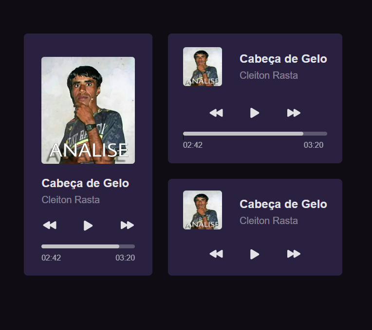

# Player de Música

## Descrição
Este é um projeto de um player de música desenvolvido com Vue 3 e Tailwind CSS. O objetivo deste projeto é criar uma interface de usuário para a reprodução de músicas.

## Tecnologias Utilizadas
- Vue 3
- Tailwind CSS

## Funcionalidades
- Controles de play, pause, próxima música e música anterior
- Barra de progresso da música
- Exibição do nome da música e do artista
- Exibição de capa do álbum

## Captura de Tela
Aqui esta uma captura de tela do layout do player de música:

